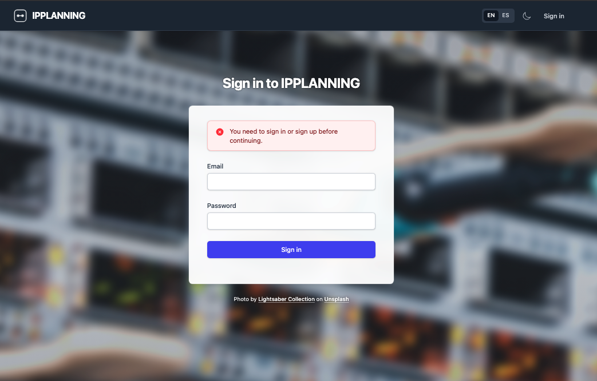
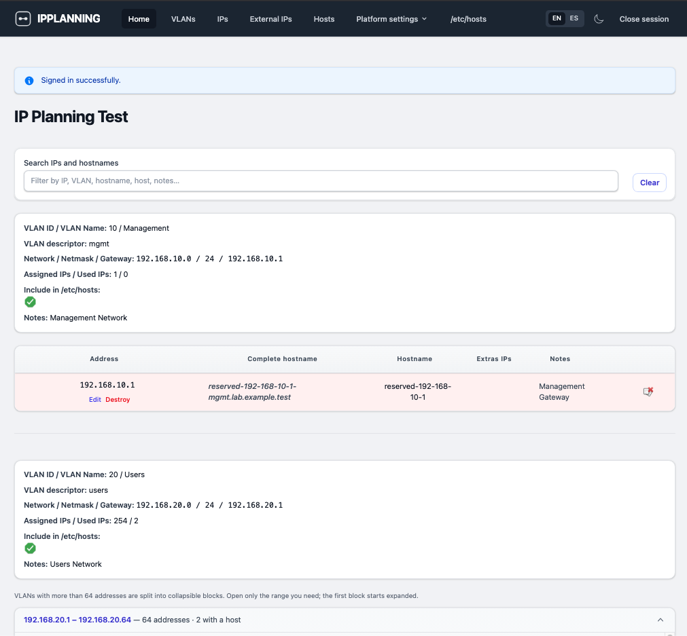

# IPPLANNING: IP Address Management System (IPAM)

<p align="center">
  
</p>

[](https://github.com/hrodrig/ipplanning/releases)
[](https://github.com/hrodrig/ipplanning/releases)
[](https://github.com/hrodrig/ipplanning/blob/main/LICENSE)


IPPLANNING is a powerful, lightweight, and modern IP Address Management (IPAM) system built with Ruby on Rails 8. It is designed to help system administrators and DevOps engineers manage network segments, VLANs, and host assignments with ease, focusing on high-performance environments like SAP and Oracle.

---

## ⚡ Quickstart (The 60-Second Setup)

Use **Ruby 3.3.0** (see [`.ruby-version`](.ruby-version)) and MySQL. For RVM gemset and Bundler, follow [Installation & Setup](#-installation--setup) first; then:

1. **Clone & install:**
   ```bash
   git clone https://github.com/hrodrig/ipplanning.git && cd ipplanning
   bundle install
   ```

2. **Configure database:**
   Update `config/database.yml` with your MySQL credentials. If you want to use the defaults, run this in your MySQL console:
   ```sql
   CREATE USER 'user'@'localhost' IDENTIFIED BY 'password';
   CREATE DATABASE ipplanning_development;
   CREATE DATABASE ipplanning_test;
   GRANT ALL PRIVILEGES ON ipplanning_development.* TO 'user'@'localhost';
   GRANT ALL PRIVILEGES ON ipplanning_test.* TO 'user'@'localhost';
   FLUSH PRIVILEGES;
   ```

3. **Initialize and run:**
   ```bash
   bin/rails db:prepare
   bin/rails app:setup
   bin/dev
   ```
   Log in at `http://localhost:3000` after creating an admin in the console (see [User Management](#-user-management)).

The **version badge** above tracks the [`VERSION`](VERSION) file; keep them in sync when you cut a release.

**0.9.2** polishes **presentation**: **light / dark theme** (toggle in the nav, `localStorage` key `ipplanning-theme`, optional system preference), Tailwind **class-based** `dark` variant, and broad **main-area** styling for dark mode. **Sign-in** uses a blurred **network hardware** background (bundled asset; Unsplash attribution on the page), tuned overlay and card contrast, and **README** screenshots (`ipplanning-login.png`, `ipplanning-ips.png`) replacing the old hero image. See [SPECIFICATIONS.md](SPECIFICATIONS.md) §3.12 and §5.

**0.9.0** improves **VLAN ↔ IP workflows**: add a **single IP** to a VLAN (CIDR validation), **horizontal VLAN picker** on VLAN show, **delete IP** from that table without a confirm dialog (with an explicit responsibility notice), and **`is_default_gateway`** on IPs (one per VLAN; updates the VLAN `gateway` field and keeps gateway row highlighting in sync). Shared UI strings include **`save` / `cancel`** for forms. See [SPECIFICATIONS.md](SPECIFICATIONS.md) §3.1 and §3.11.

**0.8.10** introduced **network switches** as first-class inventory (not hosts): admin CRUD, optional rack placement, `SwitchPort` labels with batch creation on save, optional **port name pattern** (e.g. `Gi1/0/1` → auto-incrementing suffix), and natural **display order** for port lists. The **rack U diagram** shows switches (indigo) alongside rack-mount hosts (green), with `highlight_network_switch_id` on the rack URL. See [SPECIFICATIONS.md](SPECIFICATIONS.md) §3.9–3.10.

---

## 📋 Table of Contents

1. [Key Features](#-key-features)
2. [Why IPPLANNING?](#-why-ipplanning)
3. [Tech Stack](#-tech-stack)
4. [Installation & Setup](#-installation--setup)
5. [User Management](#-user-management)
6. [Basic Configuration](#-basic-configuration)
7. [Demo sandbox reset](#-demo-sandbox-reset)
8. [Contributing](#-contributing) · [CONTRIBUTING.md](CONTRIBUTING.md)
9. [License](#-license)

---

## 🚀 Key Features

- **VLAN Management:** Easily define and organize network segments.
- **IP Allocation:** Keep track of every IP address within your VLANs.
- **Infrastructure Mapping:** Track resource allocation (vCPUs, RAM, Sockets) across different environments (Production, Development, QA).
- **Automated `/etc/hosts` Generation:** Generate synchronized host files for Unix-like servers, essential for environments where DNS resolution is a bottleneck.
- **Modern UI:** Clean and responsive interface built with Tailwind CSS.
- **External IP Tracking:** Manage public or external IPs associated with your internal hosts.
- **Rack visualization:** Vertical **U** layout with hosts and **network switches**, occupancy colors, and deep links that focus a chosen device.
- **Network switches:** Track switch hardware, ports, firmware, and rack position separately from hosts (Platform settings → Network switches).

<p align="center">
  
</p>
<p align="center"><em>Admin IP overview: client-side search, VLAN sections, and collapsible address blocks for large subnets.</em></p>

[↑ Back to Top](#-table-of-contents)

---

## 💡 Why IPPLANNING?

In large-scale distributed environments (especially SAP or Oracle), name resolution performance is critical. Many organizations prefer using `/etc/hosts` files over DNS to minimize latency and dependency on external services.

IPPLANNING simplifies this by providing a single source of truth for your network topology, allowing you to export and synchronize host files across your entire infrastructure effortlessly.

[↑ Back to Top](#-table-of-contents)

---

## 🛠 Tech Stack

- **Backend:** [Ruby on Rails 8.0](https://rubyonrails.org/)
- **Runtime:** [Ruby 3.3.0](https://www.ruby-lang.org/) (pinned in [`.ruby-version`](.ruby-version); newer 3.3.x patch releases usually work locally)
- **Database:** MySQL / MariaDB
- **Frontend:** [Tailwind CSS v4](https://tailwindcss.com/), [Hotwire](https://hotwired.dev/) (Turbo & Stimulus)
- **Assets:** [Propshaft](https://github.com/rails/propshaft) & [Importmaps](https://github.com/rails/importmap-rails) (No Node.js required)
- **Auth:** [Devise](https://github.com/heartcombo/devise)

[↑ Back to Top](#-table-of-contents)

---

## 📥 Installation & Setup

### Prerequisites

- **Ruby 3.3.0** (see [`.ruby-version`](.ruby-version); RVM recommended with gemset from [`.ruby-gemset`](.ruby-gemset))
- MySQL 5.7+ or MariaDB
- **Bundler** matching `Gemfile.lock` (see `BUNDLED WITH`, currently **4.0.x**)

### Step-by-Step Installation

1. **Clone the repository:**
   ```bash
   git clone https://github.com/hrodrig/ipplanning.git
   cd ipplanning
   ```

2. **RVM and gemset (recommended):**  
   This repo pins Ruby and gemset via [`.ruby-version`](.ruby-version) (`3.3.0`) and [`.ruby-gemset`](.ruby-gemset) (`ipplanning`) — together that is **`3.3.0@ipplanning`** in RVM terms.  
   - **First time only:** create and select the gemset (requires Ruby 3.3.0 installed in RVM, e.g. `rvm install 3.3.0`):
     ```bash
     rvm use 3.3.0@ipplanning --create
     ```
   - **After that:** with RVM shell integration (`rvm get stable` / default macOS/Linux setup), `cd` into the project directory usually auto-selects `3.3.0@ipplanning`. If not, run `rvm use` once in the project root.
   - **Check:** `rvm current` should show `ruby-3.3.0@ipplanning` (or `ruby-3.3.0-p...@ipplanning` depending on patch level).

3. **Install dependencies:**
   ```bash
   bundle install
   ```

4. **Setup the database:**
   *(Make sure to update `config/database.yml` with your local credentials)*
   ```bash
   bin/rails db:prepare
   ```

5. **Initialize application settings:**
   ```bash
   bin/rails app:setup
   ```

6. **Start the development server:**
   ```bash
   bin/dev
   ```

[↑ Back to Top](#-table-of-contents)

---

## 👤 User Management

For security reasons, user registration is disabled via the web interface. To create your first administrator:

1. **Open the Rails Console:**
   ```bash
   bin/rails c
   ```

2. **Create the Admin User:**
   ```ruby
   Admin.create!(email: 'admin@example.com', password: 'your_secure_password')
   ```

There is **no web “forgot password”** flow (by design). To change an admin password later, use the **Rails console** on a trusted path with the same pattern (`find_by!` / assign `password` + `password_confirmation` / `save!`).

[↑ Back to Top](#-table-of-contents)

---

## ⚙️ Basic Configuration

Once logged in, navigate to the **Settings** section to configure:
- **Brand & Website Name:** Customize the app's appearance.
- **Domain Name:** Define your default internal domain.
- **Auth Requirements:** Enable or disable additional HTTP Basic Auth for specific endpoints.

[↑ Back to Top](#-table-of-contents)

---

## 🧪 Demo sandbox reset

For a **public demo** or QA host where visitors may change data, you can wipe and reload a **fixed dataset** (VLANs with many IPs, hosts, external IPs, settings, and a known admin).

| Task | Command |
| :--- | :--- |
| Full reset (purge + populate) | `bin/rails demo:reset` |
| Purge only | `bin/rails demo:purge` |
| Populate only (after a manual purge) | `bin/rails demo:populate` |

**Safety:** Outside `development` / `test`, tasks refuse to run unless **`DEMO_RESET_ALLOWED=1`** is set in the environment. This avoids wiping a real production database by mistake.

**Default admin (override with env):**

| Variable | Default |
| :--- | :--- |
| `DEMO_ADMIN_EMAIL` | `demo-admin@demo.ipplanning.local` |
| `DEMO_ADMIN_PASSWORD` | `demo-demo-demo` |

**Scheduled reset (every 2 hours)** on the demo server, using your app path and deploy user:

```bash
0 */2 * * * cd /path/to/ipplanning && DEMO_RESET_ALLOWED=1 RAILS_ENV=production /path/to/bundle exec rails demo:reset >> log/demo-reset.log 2>&1
```

The dataset is defined in `lib/demo/populator.rb` (three VLANs including a `/24` for chunked IP lists, multi-homed host, reserved IP, alias, external IPs). Adjust there if you need different scenarios.

[↑ Back to Top](#-table-of-contents)

---

## 🤝 Contributing

We welcome contributions. Read **[CONTRIBUTING.md](CONTRIBUTING.md)** for branch flow (`develop` → `main`), tests, and how the whitelist `.gitignore` works.

Quick flow:

1. Fork the project (if you are not a direct collaborator).
2. Create a focused branch (for example `git checkout -b feat/short-topic`).
3. Run **`bin/rails test`** before opening a PR.
4. Open a pull request **against `develop`**.

[↑ Back to Top](#-table-of-contents)

---

## 📜 License

Distributed under the MIT License. See `LICENSE` for full text.

---
*Developed by Hermes Rodríguez - Updated for Rails 8 & Modern Standards.*
