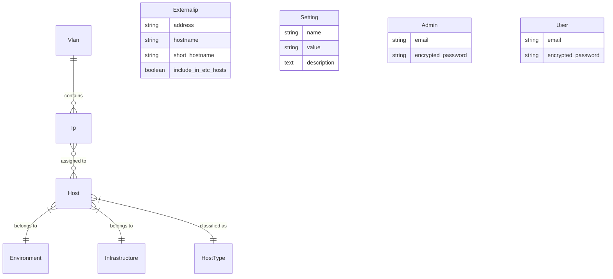
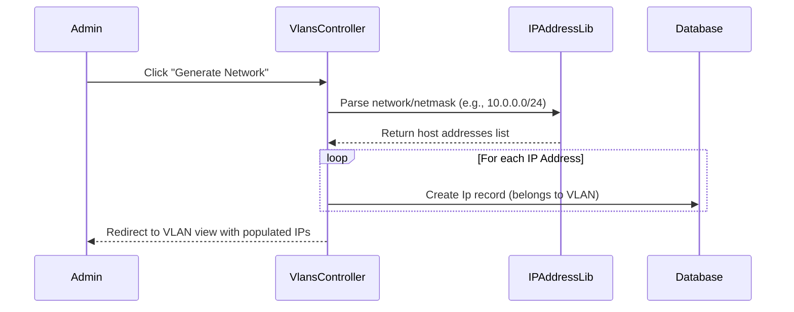
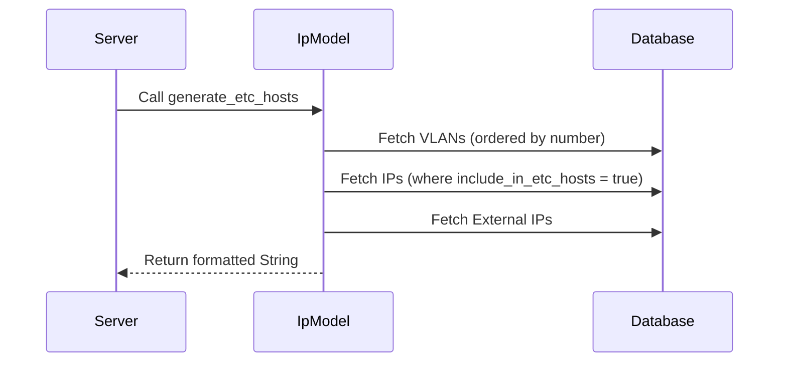

# IPPLANNING Specifications

## 1. Overview
IPPLANNING is a web-based IP Address Management (IPAM) application designed for network administrators to manage VLANs, IP allocations, and Host assignments. A key unique feature is its ability to generate synchronized `/etc/hosts` files, which is particularly valuable in environments where high-frequency name resolution is required and DNS latency or implementation is a concern (e.g., SAP, Oracle clusters).

## 2. Core Domain Model

### 2.1 Entity Relationship Diagram (ERD)

### 2.2 Model Definitions

| Model | Description | Key Attributes |
| :--- | :--- | :--- |
| **Vlan** | Represents a logical network segment. | `number`, `name`, `network`, `netmask`, `gateway`, `descriptor` |
| **Ip** | Represents a specific IP address within a VLAN. | `address`, `include_in_etc_hosts`, `hostname_alias`, `is_reserved` |
| **Host** | Represents a physical or virtual machine. | `name`, `description`, `memory_size`, `total_vcpus` |
| **Externalip** | Standalone entries for external IPs to be included in `/etc/hosts`. | `address`, `hostname`, `short_hostname` |
| **Environment** | Classification for host lifecycles. | `name` (e.g., Production, Staging, QA, Development) |
| **Infrastructure**| Hosting platform classification. | `name` (e.g., VMWare, AWS, Bare Metal, Azure) |
| **HostType** | Functional classification of the host. | `name` (e.g., DB Server, App Server, Load Balancer) |
| **Setting** | Global application configuration. | `name`, `value` (e.g., WebsiteName, DomainName) |

---

## 3. Functional Specifications

### 3.1 VLAN & Network Management
- **VLAN Definition:** Admins can create VLANs by specifying a network address and CIDR netmask.
- **Network Generation:** The `generate_network` action uses the `ipaddress` library to automatically populate a VLAN with all valid host IP addresses in its range.
- **Reserved IPs:** IPs can be marked as `is_reserved`, preventing them from being associated with a Host.

### 3.2 Host & IP Assignment
- **Many-to-Many Relationship:** A Host can have multiple IPs (across different VLANs), and an IP can be associated with a Host.
- **Hostname Logic:** The application dynamically calculates hostnames:
  - **Short Hostname:** `host.name` + optional `vlan.descriptor`.
  - **Long Hostname (FQDN):** `short_hostname` + global `DomainName` setting.
  - **Alias Support:** IPs can have custom `hostname_alias` which overrides default calculations.

### 3.3 /etc/hosts Generation
- **Automated Export:** Generates a standard `/etc/hosts` formatted string.
- **Selection Logic:** Only IPs and VLANs marked with `include_in_etc_hosts` are included.
- **Header Metadata:** Includes generation timestamps and audit information.
- **Downloadable:** Available via a dedicated endpoint (`/etc/hosts/download`).

### 3.4 Security & Access Control
- **Role-Based Auth:**
  - **Admins:** Full access to manage VLANs, IPs, Hosts, and Settings.
  - **Users:** (Reserved for future read-only or limited access).
- **HTTP Basic Auth:** Optional secondary security layer configured via global settings (`BasicAuthRequired`).

---

## 4. Technical Workflows

### 4.1 IP Generation Flow

### 4.2 /etc/hosts Export Flow

---

## 5. UI/UX Standards
- **Framework:** Tailwind CSS v4.
- **Responsiveness:** Mobile-first design with a responsive sidebar/navbar.
- **Interactivity:** Hotwire (Turbo & Stimulus) for seamless page transitions without full reloads.
- **Feedback:** Standardized Tailwind-styled alerts for notices and errors.

---

## 6. Glossary
- **IPAM:** IP Address Management.
- **VLAN Descriptor:** A short tag (e.g., `mgm`, `srv`) added to hostnames to distinguish interfaces.
- **Safe Navigation:** Ruby pattern (`&.`) used to prevent crashes when accessing settings that might not be initialized.
