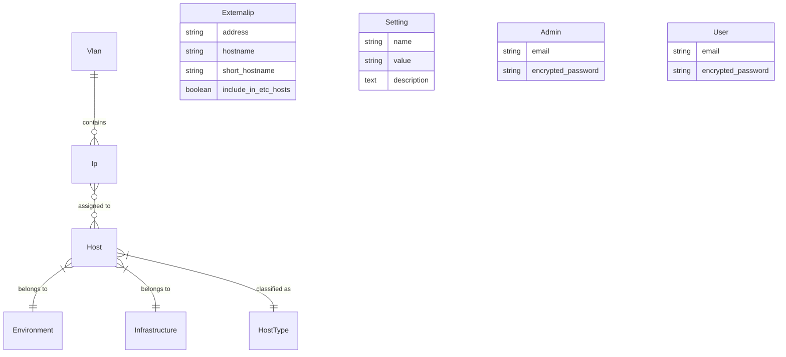
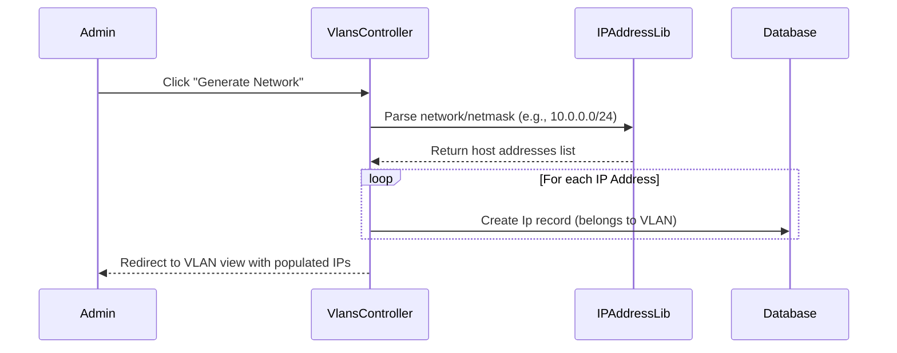
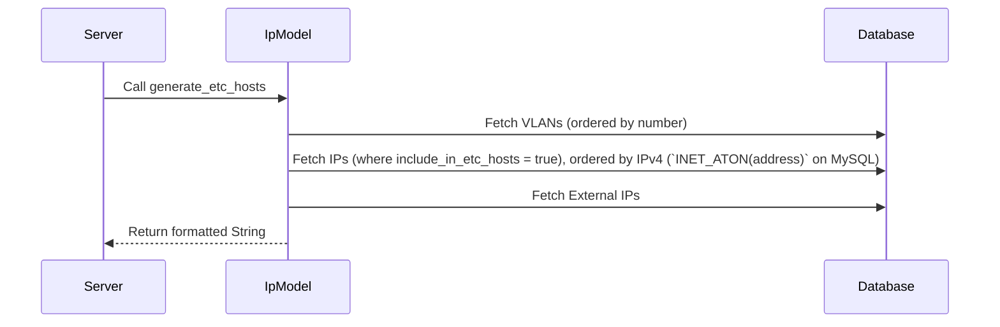

# IPPLANNING Specifications

## 1. Overview
IPPLANNING is a web-based IP Address Management (IPAM) application designed for network administrators to manage VLANs, IP allocations, and Host assignments. A key unique feature is its ability to generate synchronized `/etc/hosts` files, which is particularly valuable in environments where high-frequency name resolution is required and DNS latency or implementation is a concern (e.g., SAP, Oracle clusters).

## 2. Core Domain Model

### 2.1 Entity Relationship Diagram (ERD)

### 2.2 Model Definitions

| Model | Description | Key Attributes |
| :--- | :--- | :--- |
| **Vlan** | Represents a logical network segment. | `number`, `name`, `network`, `netmask`, `gateway`, `descriptor` |
| **Ip** | Represents a specific IP address within a VLAN. | `address`, `include_in_etc_hosts`, `hostname_alias`, `is_reserved`; see §3.5–3.7 for list UX, search, and sort helpers (`searchable_text`, `ipv4_sort_integer`, `sort_key_extras_ips`) |
| **Host** | Represents a physical or virtual machine. | `name`, `description`, `memory_size`, `total_vcpus` |
| **Externalip** | Standalone entries for external IPs to be included in `/etc/hosts`. | `address`, `hostname`, `short_hostname`; shares IPv4 ordering helpers with `Ip` via `Ipv4AddressSortable` (§3.7) |
| **Environment** | Classification for host lifecycles. | `name` (e.g., Production, Staging, QA, Development) |
| **Infrastructure**| Hosting platform classification. | `name` (e.g., VMWare, AWS, Bare Metal, Azure) |
| **HostType** | Functional classification of the host. | `name` (e.g., DB Server, App Server, Load Balancer) |
| **Setting** | Global application configuration. | `name`, `value` (e.g., WebsiteName, DomainName) |

---

## 3. Functional Specifications

### 3.1 VLAN & Network Management
- **VLAN Definition:** Admins can create VLANs by specifying a network address and CIDR netmask.
- **Network Generation:** The `generate_network` action uses the `ipaddress` library to automatically populate a VLAN with all valid host IP addresses in its range.
- **Reserved IPs:** IPs can be marked as `is_reserved`, preventing them from being associated with a Host.

### 3.2 Host & IP Assignment
- **Many-to-Many Relationship:** A Host can have multiple IPs (across different VLANs), and an IP can be associated with a Host.
- **Hostname Logic:** The application dynamically calculates hostnames:
  - **Short Hostname:** `host.name` + optional `vlan.descriptor`.
  - **Long Hostname (FQDN):** `short_hostname` + global `DomainName` setting.
  - **Alias Support:** IPs can have custom `hostname_alias` which overrides default calculations.

### 3.3 /etc/hosts Generation
- **Automated Export:** Generates a standard `/etc/hosts` formatted string.
- **Selection Logic:** Only IPs and VLANs marked with `include_in_etc_hosts` are included.
- **Header Metadata:** Includes generation timestamps and audit information.
- **Downloadable:** Available via a dedicated endpoint (`/etc/hosts/download`).

### 3.4 Security & Access Control
- **Role-Based Auth:**
  - **Admins:** Full access to manage VLANs, IPs, Hosts, and Settings.
  - **Users:** (Reserved for future read-only or limited access).
- **HTTP Basic Auth:** Optional secondary security layer configured via global settings (`BasicAuthRequired`).

### 3.5 IP list presentation (admin IPs index & home)
Large VLANs (many rows) are easier to scan using **chunked, collapsible blocks** and constrained scroll:

- **Chunking rule:** If a VLAN has **more than 64** IP rows, addresses are split into contiguous slices of up to **64** records each (ordered numerically by IPv4; see §3.7).
- **Collapsible UI:** Each slice is rendered as a `
` block with a summary showing address range and counts (total addresses vs. addresses with a host).
- **Default open state:** The **first** chunk is open by default; others start collapsed. Attribute `data-default-open` preserves this for resetting UI after clearing filters (§3.6).
- **Scroll:** The table body inside an open chunk uses a **max-height** with vertical scroll so the page does not grow unbounded.
- **Sticky header:** Shared partial `_ip_table_head` renders a **sticky** `<thead>` while scrolling within a chunk.
- **Single-table VLANs:** VLANs with ≤64 IPs use one table wrapped with `data-ip-table-wrap` (scroll when row count is high but still a single block).
- **Styling:** Chevron rotation on open/closed chunks is handled in Tailwind/application CSS (`.ip-index-chunk`).

### 3.6 IP list search & filter (client-side)
Authenticated **IPs** index and **home** (`welcome#index`) expose a **search** field that filters rows **in the browser** (no server round-trip):

- **Stimulus controller:** `ip-index-filter` (`app/javascript/controllers/ip_index_filter_controller.js`).
- **Row metadata:** Each IP row exposes `data-ip-search` with a normalized, HTML-escaped blob from `Ip#searchable_text` (address, aliases, hostnames, notes, VLAN fields, linked host names, etc.). External IP rows on the home page use a smaller derived blob (address, hostnames, notes).
- **Behavior:**
  - Rows that do not match the query are hidden (`hidden` / `classList`).
  - For chunked VLANs, `<details.ip-index-chunk>` blocks with **no** visible rows are hidden; blocks with matches are shown and **opened** while filtering.
  - VLAN sections and the external-IP block use `data-ip-vlan-section` / `data-ip-external-block` to hide entire sections when nothing matches.
  - **Clear** resets the query, visibility, and chunk `open` state according to `data-default-open`.
- **UX copy:** Filter label, placeholder, clear action, match count template, and empty-state message are localized (`ips_filter_*` keys).

### 3.7 IP ordering & table column sorting
**Correct IPv4 order (not lexicographic):** Sorting by the string `address` places `…201.19` after `…201.189`. The application therefore uses **numeric IPv4 ordering**:

- **Concern:** `Ipv4AddressSortable` (`app/models/concerns/ipv4_address_sortable.rb`), included in `Ip` and `Externalip`.
- **Database (MySQL):** Scope `order_by_ipv4_address` uses `ORDER BY INET_ATON(address) ASC` on the model table. Used for VLAN IP lists, host IP summaries, `/etc/hosts` generation order, external IP listings, etc.
- **Fallback:** Non-MySQL adapters fall back to `order(:address)` until a portable expression is added.
- **32-bit sort key:** `ipv4_sort_integer` packs a valid dotted IPv4 into an integer for client-side tie-breaking and attributes.

**Interactive column sort (Stimulus):**

- **Controller:** `ip-table-sort` (`app/javascript/controllers/ip_table_sort_controller.js`) on each sortable `<table>`.
- **Headers:** Address, complete hostname, short hostname, extras, and notes columns use buttons that cycle **ascending / descending** on repeated clicks; a small **↑ / ↓** marker shows the active column.
- **Row `data-*` keys:** `data-sort-ip`, `data-sort-complete`, `data-sort-short`, `data-sort-extras`, `data-sort-notes` (populated from `Ip` fields and `sort_key_extras_ips` for the extras column).
- **External IPs (admin index & home):** Same pattern for IP, hostname, short hostname, and notes; the admin list’s `#` column uses `js-row-index` so row numbers stay **1…n** after reordering.

### 3.8 Demo sandbox dataset & reset
- **Purpose:** A throwaway dataset for public demos or scheduled sandboxes so users can explore CRUD, large IP lists, search, and sorting without polluting long-lived data.
- **Implementation:** `Demo::Populator` in `lib/demo/populator.rb` deletes core rows (`hosts_ips`, IPs, hosts, VLANs, taxonomy, external IPs, locations/racks, users, admins, settings, Active Storage) and recreates representative records (including a `/24` VLAN for chunk UX).
- **Rake tasks:** `rails demo:reset` (purge + populate), `rails demo:purge`, `rails demo:populate` (see `lib/tasks/demo.rake`).
- **Guardrail:** Outside Rails `local?` environments, tasks require **`DEMO_RESET_ALLOWED=1`**. Optional env: `DEMO_ADMIN_EMAIL`, `DEMO_ADMIN_PASSWORD`.
- **Operations:** Cron-friendly; README documents a **2-hour** example schedule.

---

## 4. Technical Workflows

### 4.1 IP Generation Flow

### 4.2 /etc/hosts Export Flow

---

## 5. UI/UX Standards
- **Framework:** Tailwind CSS v4.
- **Responsiveness:** Mobile-first design with a responsive sidebar/navbar.
- **Interactivity:** Hotwire (Turbo & Stimulus) for seamless page transitions without full reloads.
- **Feedback:** Standardized Tailwind-styled alerts for notices and errors.
- **IP-heavy views:** Chunked VLAN tables (§3.5), client-side filter (`ip-index-filter`, §3.6), and per-table column sort (`ip-table-sort`, §3.7) on the admin IPs index, home VLAN tables, and external IP tables where implemented.
- **Operator guide:** Collapsible IP blocks and the search box are also summarized under `section_intro.ips` tips in locale files (`en.yml` / `es.yml`).

---

## 6. Glossary
- **IPAM:** IP Address Management.
- **VLAN Descriptor:** A short tag (e.g., `mgm`, `srv`) added to hostnames to distinguish interfaces.
- **Safe Navigation:** Ruby pattern (`&.`) used to prevent crashes when accessing settings that might not be initialized.
